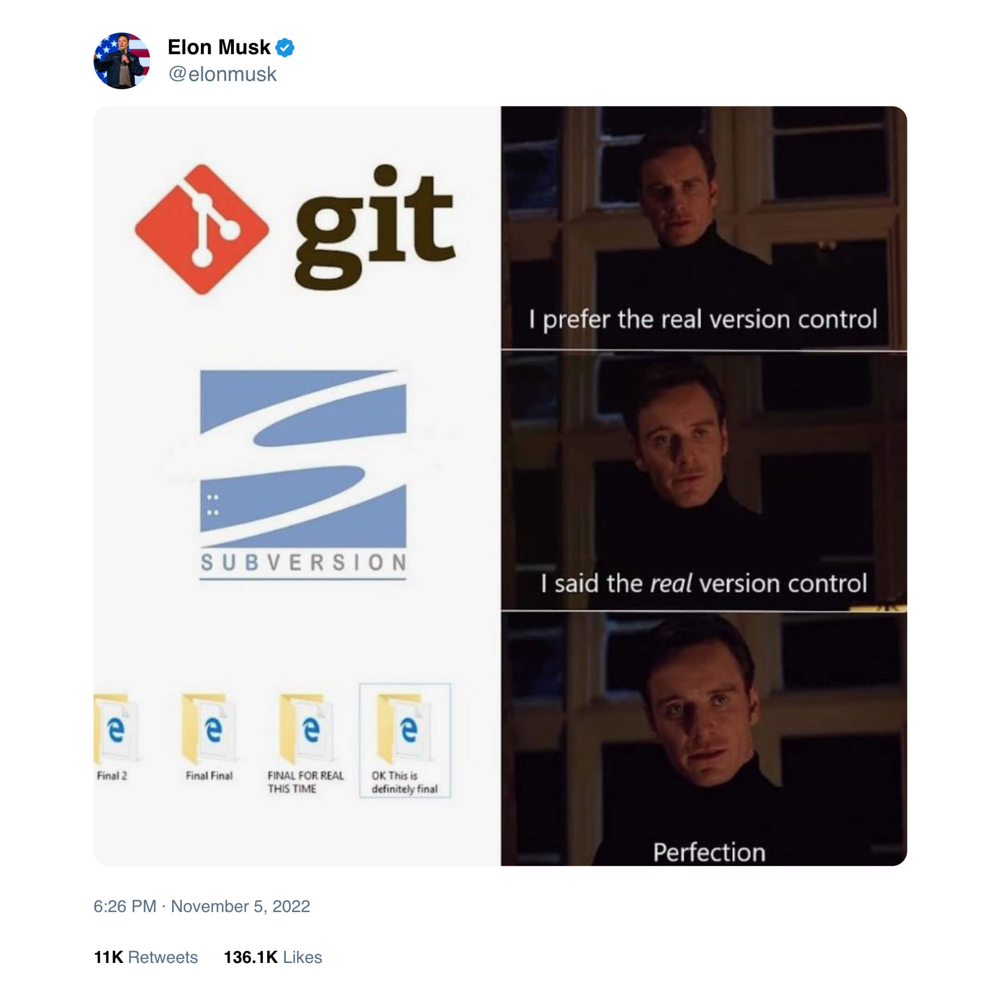

[Ondrej Sika (sika.io)](https://sika.io) | <ondrej@sika.io> | [course ->](#course)

# Git Training

## Install Git

Download installer from <https://git-scm.com> or use package manager.

### Mac

```
brew install git
```

### Linux

```
apt install git
```

### Windows

<https://git-scm.com/downloads/win>

```
winget install -e --id Git.Git
```

```
choco install git
```

## Editor

I prefer VS Code, you can download it here: <https://code.visualstudio.com/download>

Or download it using package manager:

### Mac

```
brew cask install visual-studio-code
```

### Windows

```
choco install vscode
```

## Install `slu`

SikaLabs Utils

- Homepage - <https://github.com/sikalabs/slu>
- Install - <https://github.com/sikalabs/slu#install>

Mac

```
brew install sikalabs/tap/slu
```

Linux

```
curl -fsSL https://raw.githubusercontent.com/sikalabs/slu/master/install.sh | sudo sh
```

Windows

```
scoop install https://raw.githubusercontent.com/sikalabs/scoop-bucket/master/slu.json
```

## Course



## About Me - Ondrej Sika

**Freelance DevOps Engineer, Consultant & Lecturer**

- Complete DevOps Pipeline
- Open Source / Linux Stack
- Cloud & On-Premise
- Technologies: Git, Gitlab, Gitlab CI, Docker, Kubernetes, Terraform, Prometheus, ELK / EFK, Rancher, Proxmox, DigitalOcean, AWS

## Star, Create Issues, Fork, and Contribute

Feel free to star this repository or fork it.

If you found bug, create issue or pull request.

Also feel free to propose improvements by creating issues.

## Chat

For sharing links & "secrets".

- Zoom Chat
- Microsoft Teams
- https://sika.link/chat (tlk.io)
- [Open](https://sikapublic.slack.com) my Slack (if you already joined), [join](https://sika.link/slack-sikapublic) if you haven't

## Slack & Newsletter

[Join my Slack](https://sika.link/slack-sikapublic) for future discussion & help.

[Subscribe to my Newsletter](https://sika.link/newsletter) for future DevOps topics.

## Overview of Git Storage

- Not diffs, but snapshots
- https://git-scm.com/book/en/v2/Getting-Started-What-is-Git


## Basic Configuration

I prefer global configuration (using `--global`) stored in your home directory applied to all repositories.

You can configure just one repo, you can call `git config` from you repository with flag `--local`.

```
git config --global user.name "Ondrej Sika"
git config --global user.email "ondrej@ondrejsika.com"
```

### Rebase workflow (if you want to use rebase workflow)

**WARNING**: Apply only if you want to use rebase workflow!

```
git config --global pull.ff only
git config --global merge.ff only
git config --global pull.rebase true
```

### Init Default Branch

```
git config --global init.defaultBranch main
```

```
git config --global init.defaultBranch master
```

## GPG sign tags by default

```
git config --global tag.gpgSign true
```

or for example disable only for local repo

```
git config --local tag.gpgSign false
```

### Git Editor

Git use by default Vim or editor from `EDITOR` environment variable. If you want to use different editor, you can configure it.

```
git config --global core.editor emacs
```

You can use GUI editors like VS Code too:

```
git config --global core.editor "code --wait"
```

See [Associating text editors with Git](https://help.github.com/en/github/using-git/associating-text-editors-with-git) on Github Help to use your editor on your platform.

Sources:

- https://help.github.com/en/github/using-git/associating-text-editors-with-git
- https://stackoverflow.com/questions/2596805/how-do-i-make-git-use-the-editor-of-my-choice-for-commits/53901686#53901686

### Git PS1

If you want to see your branch in terminal prompt you have to use [git-prompt.sh](https://github.com/git/git/blob/master/contrib/completion/git-prompt.sh).

It works on Unix (ZSH & Bash). If you use Windows, it works by default in Git Bash and there is no way how add it into CMD or PowerShell.

Install On Unix:

```sh
wget https://github.com/git/git/raw/master/contrib/completion/git-prompt.sh
mv git-prompt.sh ~/.git-prompt.sh
echo ". ~/.git-prompt.sh " >> ~/.bashrc
```

You have to add `__git_ps1` to your `PS1` variable.

Bash Example:

```bash
export PS1='\033[01;32m\]\u@\h\[\033[00m\]:\[\033[01;34m\]\w\[\033[00m\]$(__git_ps1)\$ '
```

Save it to `.bashrc`:

```bash
echo "export PS1='\033[01;32m\]\u@\h\[\033[00m\]:\[\033[01;34m\]\w\[\033[00m\]$(__git_ps1)\$ '" >> ~/.bashrc
```

## Aliases

You can create own git aliases:

```
git config --global alias.<alias> <command>
```

Examle:

```
git config --global alias.co checkout
git config --global alias.br branch
git config --global alias.ci commit
git config --global alias.st status
```

Usage of aliases is `git co` for `git checkout`, `git ci` for `git commit`, ...

Those aliases work on every platform (event Windows).

## My Git Aliases

From [ondrejsika/dotfiles](https://github.com/ondrejsika/dotfiles/blob/master/core/zshrc#L12)

```
alias st='git status'
alias sta='git status --untracked-files=all'
alias di='git diff'
alias dis='git diff --staged'
alias dit='git diff | tig'
alias dist='git diff --staged | tig'
alias ci='git commit'
alias co='git checkout'
alias br='git branch'
alias ad='git add'
alias fa='git fetch --all --prune'
alias ga='gitk --all'
alias glo='git log --oneline '
```

I also use alias completion using complete alias, eg: `complete -F _complete_alias st` for `st` alias.

## `slu git`

```
slu git url open
```

With alias `alias guo="slu git url open"`

```
guo
```

```
slu git url get
```

```
slu git use-ssh
```

## VS Code and Git

- Git Graph Plugin - <https://marketplace.visualstudio.com/items?itemName=mhutchie.git-graph>

## Demo Gitlab

- URL: <https://gitlab.sikademo.com>
- User: `demo-user`
- Password: `asdfasdf`

## New Repository

Create on [Github](https://github.com/new) (eg.: `example-repository`) and clone it.

```
git clone git@github.com:ondrejsika/example-repository.git
cd example-repository
```

or create it locally

```
mkdir example-repository
cd example-repository
git init
```

## Gitignore

File `.gitignore` defines files ignored by Git. Those files doesn't exist for Git. This is a simple example for Next.js project.

```
.vscode
node_modules
.next
out
```

### Github Gitignore Templates

<http://github.com/github/gitignore>

## EditorConfig

File `.editorconfig` define editors behavior, like spaces vs tabs or tab size, for example.

```
root = true
[*]
indent_style = space
indent_size = 2
charset = utf-8
trim_trailing_whitespace = true
insert_final_newline = true
end_of_line = lf
max_line_length = off
```

## slu file-templates: gitignore & editorconfig

Gitignore

```
slu file-templates gitignore
```

```
slu ft gi
```

```
slu file-templates gitignore --terraform --node
```

```
slu ft gi --terraform --node
```

Editorconfig

```
slu file-templates editorconfig
```

```
slu ft ec
```

```
slu file-templates editorconfig --go --python
```

```
slu ft ec --go --python
```

## Basic Commands

### `git status`

Show status of repository. See which files are edited or want to be committed.

```
git status
```

Show all untracked files in status

```
git status --untracked-files=all
```

### `git add`

Add file to next commit

```
git add <path>
```

Examples

```
git add index.html
git add .
```

### Partial `git add`

You can use `-p` to switch into interactive mode and select part of changed file, which you want to commit.

```
git add -p <path>
```

### `git diff` for new changes

You can see changes before `git add` or `git commit`.

See new changes in files managed by Git (not in new files):

```
git diff
```

If you want to see staged changes (added, prepared for commit), you have to use:

```
git diff --staged
```

### Unstage

Remove changes from next commit

```
# Unstage all changes
git reset

# Unstage file
git reset -- <path>
```

### `git commit`

Save prepared changes to repository

#### Create commit from all staged changes

```
git commit
```

#### Create commit form all changes (not new files)

```
git commit -a
```

#### Commit one file (not new files)

```
git commit <file>
```

#### Specify message in parameter insted of open vim

```
git commit -m "<message>"
```

#### Combination of -a -m params

```
git commit -am "<message>"
```

#### Update latest commit

```
git commit --amend
```

### Conventional Commits

<https://www.conventionalcommits.org/>

```
<type>[(<scope>)]: <message>
```

Types:

- `feat`
- `fix`
- `chore`

My aditional types:

- `init`
- `VERSION`
- `content`
- `ci`
- `docs`
- `refactor`
- `cleanup`

My format with prefix:

```
[[prefix]] <type>[(<scope>)]: <message>
```

Prefixes:

- `[auto]`

### `git log`

Show history of commits

```
git log
git log --oneline
git log --oneline --graph --all
```

### Browsing history

#### Tig

Simple terminal history browser for Git

##### Install

Mac

```
brew install tig
```

Linux

```
apt install tig
```

##### Usage

```
# only actual branch
tig

# all branches
tig --all
```

#### Gitk

Graphic commit log. Distributed with Git.

```
# only actual branch
gitk

# all branch
gitk --all
```

### Remote Repository (Github, Gitlab)

If you have clonned repository, `git clone` has added configuration of repository.

Check it by:

```
git remote -v
```

and you will see:

```
ondrej@sika-macbookpro:~/example-repository (master)$ git remote -v
origin	git@github.com:ondrejsika/example-repository.git (fetch)
origin	git@github.com:ondrejsika/example-repository.git (push)
```

If you've created repository by `git init` you see nothing.

### Add Remote Repository

To add remote repository, you have to use:

```
git remote add <name> <url>
```

For example:

```
git remote add origin git@github.com:ondrejsika/example-repository.git
```

Now you can push & share your code with collaborators. Check `git remote -v`.

### Rename & Remove Remote Repository

If you want to rename remote repository, use:

```
git remote rename <name> <new name>
```

If you want delete remote, use:

```
git remote remove <name>
```

### `git push`

Push your commits to remote repository (Github).

```
# Push new branch to repository
git push <remote> <branch> -u

# Push commit
git push
```

### `git pull`

Pull new commits from remote repository (Github).

```
git pull
```

## Working with Branches

### Stash

Git stash is used for temporarily postpone your changes to make your working directory clean.

That's required by some Git commands like `git rebase`, ... or sometimes for `git checkout`, `git cherry-pick`, ...

If you want to stash changes, use:

```
git stash
```

And check status using `git status`.

If you want to see, which files are stashed, use:

```
git stash show
```

If you want to see patch, add `-p`:

```
git stash show -p
```

If you want to apply stashed changes and remove stash, use:

```
git stash pop
```

And check `git diff` and `git stash show`.

If you have multiple stashes you work only with the latest.

List all stashes:

```
git stash list
```

If you want to specify other stash you can use `stash@{0}`. For example:

```
git stash show stash@{1}
git stash show -p stash@{1}
```

More about stash in offical documentation - <https://git-scm.com/docs/git-stash>

### List Branches

```
# Show local branches
git branch

# Show all branches (with the branches of remote repository - on Github)
git branch --all
```

### Switch vs Checkout

Switch is new command which implements part of checkout functionality.

See: <https://stackoverflow.com/a/70454786/5281724>

### Create a Branch

Create branch (and dont switch to it)

```
git branch <new_branch> [<branch_from>]
```

Switch branch

```
git checkout <branch>
```

```
git switch <branch>
```

Create branch and switch to it

```
git checkout -b <new_branch> [<branch_from>]
```

```
git switch -c <new_branch> [<branch_from>]
```

### Switch Branch

```
git checkout <branch>
```

```
git switch <branch>
```

### Push & Pull Branch

```
# Push commits to remote repository (Github)
git push <remote> <branch> -u

# Pull new commits to my branch
git pull
```

### Merging Branches

You can merge branches locally or on Github / Gitlab using Pull / Merge Requests.


### Rebase

See my czech article about rebase: https://ondrej-sika.cz/git/rebase/

## Git Reset

Reset HEAD (current brach) to specific state.

Set HEAD to specific state, but don't change files in working directory.

```
git reset <commit>
```

If you want also reset files, use `--hard`:

```
git reset --hard <commit>
```

### Remove Last Commit

For example, you want to remove last commit but want to keep changes:

```
git reset HEAD~1
```

See `git status` and `git diff`, files from last commit are now in changed.

If you want remove last commit with its changes, use:

```
git reset --hard HEAD~1
```

And see (`git status`, `git diff`), no changes.

## Interactive Rebase

Create some demo commits:

```
touch A
git add A
git commit -m A
touch B
git add B
git commit -m B
touch C
git add C
git commit -m C
touch D
git add D
git commit -m D
touch E
git add E
git commit -m E
touch F
git add F
git commit -m F
touch G
git add G
git commit -m G
touch H
git add H
git commit -m H
```

You rewrite history, join commits, update messages, reorder commits, ...

```
git rebase -i <ref>
```

Example:

```
git rebase -i HEAD~6
```

## Cherry Pick

Copy commit (ref) to actual HEAD.

```
git cherry-pick <ref>
```

Example:

```
git cherry-pick v1.0.x
git cherry-pick 47bdfb7
```

## `git reflog`

Reflog shows a history of refference. By default shows a `HEAD`. You can undo any git operations even reset.

```
git reflog
```

```
git reflog <branch>
```

## `git tag`

Create tag:

```
git tag <tag> [<ref>]
```

Example:

```
git tag v1.0.0
git tag v1.0.0 HEAD~1
git tag v1.0.0 master
git tag v1.0.0 075615a
```

List tags:

```
git tag
```

Push tag:

```
git push <remote> <tag>
```

Example:

```
git push origin v1.0.0
```

Push all tags:

```
git push <remote> --tags
```

Example:

```
git push origin --tags
```

Delete tag (not recommended):

```
git tag -d <tag>
```

Example:

```
git tag -d v1.0.1
```

Delete tag from server:

```
git push <remote> :<tag>
```

Example:

```
git push origin :v1.0.2
```

## `git blame`

See authors of actual code

```
git blame <file>
```

See authors of code in specific revision

```
git blame <rev> <file>
```

See only lines from 1 to 10

```
git blame -L 1,10 <file>
```

## Submodules

Clone repository with submodules:

```
git clone --recursive <repo_url>
```

If you have cloned repository without `--recursive` you have to:

```bash
git submodule update --init
# for nested submodules
git submodule update --init --recursive
```

Add submodule to repository:

```bash
git submodule init
git submodule add <submodule_repo_url> [<path>]
```

Add submodule and track specific branch:

```
git submodule add -b <branch> <submodule_repo_url> [<path>]
```

Update tracked branch:

```
git submodule set-branch --branch <branch> <path>
```

Update remote repository:

```
git submodule set-url <path> <newurl>
```

Update submodule from remote repository

```
git submodule update --remote
```

Pull changes & pull submodules

```
git pull --recurse-submodules
```

Execute command for each submodule:

```bash
git submodule foreach 'git reset --hard'
# including nested submodules
git submodule foreach --recursive 'git reset --hard'
```

## Thank you! & Questions?

That's it. Do you have any questions? **Let's go for a beer!**

### Ondrej Sika

- email: <ondrej@sika.io>
- web: <https://sika.io>
- twitter: [@ondrejsika](https://twitter.com/ondrejsika)
- linkedin: [/in/ondrejsika/](https://linkedin.com/in/ondrejsika/)
- Newsletter, Slack, Facebook & Linkedin Groups: <https://join.sika.io>

_Do you like the course? Write me recommendation on Twitter (with handle `@ondrejsika`) and LinkedIn (add me [/in/ondrejsika](https://www.linkedin.com/in/ondrejsika/) and I'll send you request for recommendation). **Thanks**._

Wanna to go for a beer or do some work together? Just [book me](https://book-me.sika.io) :)

## Extra

## `git bisect`

Git bisect helps you find commit which introduce a bug

Start bisect session

```
git bisect start
```

Select goog commit

```
git bisect goog <ref>
```

Set bad commit

```
git bisect bad <ref>
```

Now check if actual working tree contains bug.

If yes

```
git bisect bad
```

In not

```
git bisect good
```

Repeat it until bisect print out the commit which introduce a bug.

To close bisect session, use:

```
git bisect reset
```

### GPG Commit Signing

```
git config --global commit.gpgsign true
```

```
git config --global user.signingkey B000780A20CF1013F7A59081775D8A020903EF6B
```

Auto setup remote on push (from Git version 2.37.0)

```
git config --global --add --bool push.autoSetupRemote true
```

Source: https://twitter.com/ji/status/1546948817462800384
